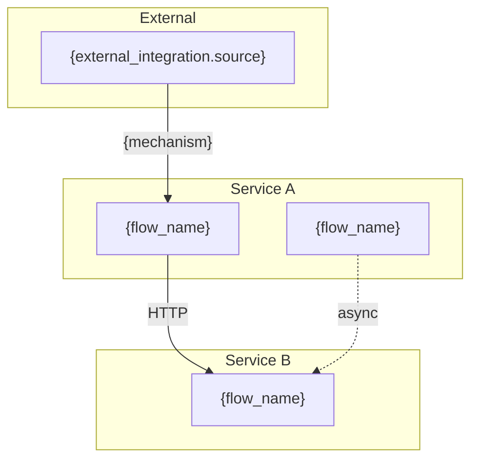
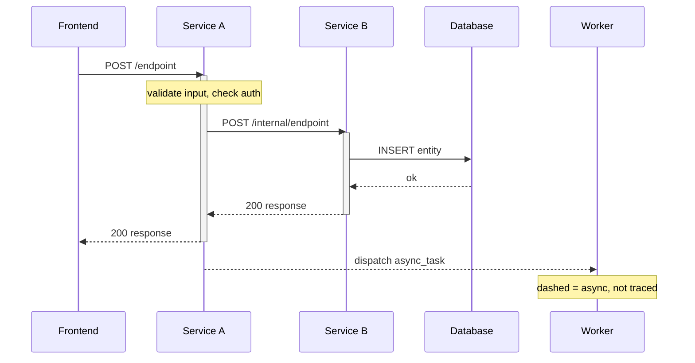

# {Domain Name}

> {Domain description from manifest}
>
> Generated: {YYYY-MM-DD}

## Overview

The overview flowchart is auto-generated from:
- Cross-flow call references discovered during tracing
- External integrations from the manifest
- Use subgraphs for service boundaries
- Solid arrows for synchronous calls, dashed for async

---

## {flow_name}

| Field | Value |
|-------|-------|
| **Route** | `{HTTP_METHOD} {path}` |
| **Auth** | `{auth_requirement}` |
| **Entry** | `{entry_file}:{line}` |
| **Source chain** | `{file}:{line}` → `{file}:{line}` → ... |
| **Frontend callers** | `{component_file}:{line}` — {description} |
| **Internal callers** | `{caller_file}:{line}` — {description} |

<!-- traced: {ISO_DATE} from {entry}:{method} -->

---

## External Integrations

| Source | Target Flow | Mechanism | Owner |
|--------|-------------|-----------|-------|
| {source} | {target} | {mechanism} | {owner} |
